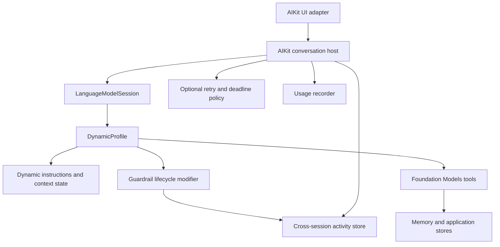

# Foundation Models Replacement and Migration Guide

## Status and scope

This document guides AIKit and AIToolKit from the current turn-oriented
runtime to the Xcode 27 Foundation Models architecture. It incorporates the
repository audit performed with Xcode 27.0 (27A5218g) and Swift 6.4.

The central decision is:

> Make `LanguageModelSession` the execution engine and source of truth, use
> `DynamicProfile` as the model-coordination layer, and keep only a thin AIKit
> host boundary for application policies the framework does not provide.

This is a partial replacement, not a claim that Foundation Models owns every
application concern. Retry policies, deadlines, durable records, and
cross-session UI activity remain host responsibilities.

## Executive summary

AIKit is already substantially aligned with the post-WWDC 2026 API. It uses
the official `LanguageModel`, `LanguageModelSession`, `DynamicProfile`, tool
hooks, typed errors, Private Cloud Compute, reasoning output, and usage
accounting. AIToolKit already expresses its workflows as dynamic profiles.

The remaining architectural duplication is concentrated in
[`Orchestrator`](Sources/AIKitRuntime/Orchestrator.swift). It constructs a
fresh session for every attempt and then adds its own event stream, phases,
history projection, activity aggregation, retries, deadlines, persistence,
and host-side guardrail stages around that session.

Xcode 27 profiles now provide the intended coordination surface for:

- Dynamic instructions, tools, models, and generation configuration.
- Profile transitions driven by observable state or tools.
- Transcript transforms and session properties.
- Prompt, response, reasoning, tool-call, and tool-output lifecycle hooks.
- Session activation and deactivation hooks.

Accordingly, the model pipeline in `Orchestrator` should be removed. Features
that do not belong to the model pipeline should move into small, independently
testable host services.

## Audit baseline

At the time of the audit:

- AIToolKit's 21 tests passed, with one deprecated
  `LanguageModelCapabilities` initializer.
- AIKit's production targets built for macOS, iOS Simulator, and visionOS
  Simulator.
- AIKit's full test suite did not compile because its provider test helper
  decodes generation-channel event implementations that are opaque in the
  installed Xcode 27 SDK.
- Two additional AIKit deprecations remained: the capabilities initializer in
  `MockLanguageModel` and the `source:` label for `StructuredSegment`.

Phase 0 below restores a clean baseline before architectural behavior changes.

## Migration goals

1. One official `LanguageModelSession` per conversation or independent task.
2. One `DynamicProfile` as the declarative owner of model behavior.
3. The official transcript, response stream, usage, and `isResponding` state
   are the canonical sources of session state.
4. Guardrails run through official lifecycle modifiers wherever their payload
   is available.
5. Retry, deadlines, persistence, and aggregate UI activity remain optional
   host policies instead of becoming a second orchestration engine.
6. Preserve typed errors, strict concurrency, and the existing no-network
   deterministic test suite.

## Non-goals

- Do not build an AIKit mirror of `DynamicProfile` or `ResponseStream`.
- Do not wrap individual tools to implement global policy.
- Do not retain two independent conversation histories.
- Do not force persistence or UI state into profile declarations.
- Do not introduce a new general-purpose orchestrator under another name.

## Target architecture



The direction of ownership is important. The conversation host calls the
session; it does not interpret or reproduce the internal tool loop. The
profile configures the session; it does not persist UI records.

## Responsibility mapping

| Current responsibility | Xcode 27 destination | Migration result |
| --- | --- | --- |
| Model, instructions, and tools | `DynamicProfile.Profile` | Remove from `Orchestrator` |
| Context-dependent configuration | Conditional profiles and dynamic instructions | Replace imperative session construction |
| Temperature, token limit, reasoning, tool-call mode | Profile modifiers | Move to profile |
| Tool execution and model/tool rounds | `LanguageModelSession` | Already native; delete host duplication |
| Streaming text | `LanguageModelSession.ResponseStream` | Remove custom text-delta transport |
| Conversation history | `LanguageModelSession.transcript` | Remove duplicate line history as a data source |
| Prompt checkpoint | `.onPrompt` | Move pre-prompt policy into a modifier |
| Tool checkpoints | `.onToolCall` and `.onToolOutput` | Already native |
| Response checkpoint | `.onResponse` or immediately after `collect()` | Move final-result policy |
| Profile lifecycle | `.onActivate` and `.onDeactivate` | Use for profile-level state only |
| Busy state | `session.isResponding` | Observe directly |
| Token usage | `session.usage` and `response.usage` | Read directly; retain persistence adapter |
| Transcript recovery on errors | `transcriptErrorHandlingPolicy` | Configure explicitly and test |
| Retry classification and backoff | AIKit host policy | Retain outside profile |
| Hard wall-clock deadline | AIKit host policy | Retain outside profile |
| Durable usage and activity | AIKit capability stores | Retain as adapters |
| Global/external work activity | Dedicated activity store | Remove from model session owner |

## Required behavioral decisions

### 1. Session lifetime

The current runtime creates a fresh session for every attempt in
[`Orchestrator.loop`](Sources/AIKitRuntime/Orchestrator.swift#L875). Turns
are independent, and durable memory is reachable only through a tool.

The recommended replacement is one session per conversation. This means:

- The transcript persists across user turns.
- A profile is re-evaluated as application state changes.
- Models, tools, instructions, and privacy transforms can change without
  discarding the complete logical conversation.
- Context-window management becomes a first-class requirement.

If turn independence is an intentional product requirement, continue creating
one session per task, but let callers construct and drive those sessions
directly from profiles. An `Orchestrator` is still unnecessary.

### 2. Concurrency ownership

A single session must not generate overlapping responses. The current
`Orchestrator` can track overlapping turns because each turn receives a
different session.

Use these boundaries:

- One session per interactive conversation.
- One separate session per independent background workflow.
- Reject or serialize overlapping sends to the same conversation.
- Aggregate multiple sessions in a separate `AIKitActivityStore` when the UI
  needs a global busy state or Cancel All operation.

### 3. Transcript ownership

The official transcript should be canonical. UI messages should be derived
from `Transcript.Entry` values or a lightweight presentation projection.
`AIKitSession.Line` should not remain an independently authoritative history.

Use:

- `historyTransform` for lossless, profile-specific filtering or redaction.
- `SessionPropertyValues.history` only for intentional lossy mutation shared
  across profiles.
- `@SessionPropertyEntry` for session-scoped workflow state.
- A new session initialized with history when rehydrating a persisted
  conversation.

Measure transcript rewriting because changing instructions, tools, or history
can invalidate provider key-value caches and can change model behavior.

### 4. Guardrail boundaries

[`GuardrailsModifier`](Sources/AIKitSafety/GuardrailsModifier.swift)
currently installs only tool hooks. Extend the profile-based safety surface as
follows:

- `prePrompt` runs in `.onPrompt` and throws before model generation.
- `preToolUse` remains in `.onToolCall` and prevents tool execution.
- `postToolUse` remains in `.onToolOutput`.
- `finalResult` runs in `.onResponse` when the callback payload is sufficient,
  or immediately after the final response is collected.

Two details need explicit tests before deleting the host checks:

1. `onPrompt` receives the official prompt, but the existing `RenderedPrompt`
   also includes rendered instructions and active tool names. Capture an
   immutable resolved-context snapshot in the modifier or modernize the
   guardrail payload to use official transcript/profile data.
2. Confirm `onResponse` cardinality for tool-using sessions and ensure the
   final-result rail evaluates the terminal user-visible response, not an
   intermediate lifecycle boundary.

Warnings do not belong in the transcript. Send them to an activity sink used
by UI and diagnostics. Blocks continue to throw
`LanguageModelError.guardrailViolation`.

### 5. Retry, cancellation, and transcript rollback

Foundation Models owns the tool loop but does not provide AIKit's complete
retry/backoff or wall-clock deadline policy.

Keep a small host policy that:

- Classifies typed errors.
- Retries only transient failures.
- Applies cancellation and an optional hard deadline.
- Accounts for usage consumed by failed attempts.
- Persists the terminal outcome.

Set `transcriptErrorHandlingPolicy` explicitly. The default rollback behavior
is suitable for most retries, while `.preserveTranscript` requires the host to
repair the transcript before reuse.

Before retrying on the same session, test all existing pinned cases, including
`GeneratedContent.ParsingError`, wrapped `ToolCallError`, raw tool-output hook
errors, cancellation, and guardrail violations. Retries must not repeat
non-idempotent tool side effects without an idempotency strategy.

### 6. Usage and durable records

The official session exposes cumulative usage, and each response exposes its
own usage. AIKit should retain its durable store while removing its duplicate
token source.

For a persistent session:

1. Snapshot `session.usage` before a turn.
2. Run the response.
3. Compute the turn delta from the new cumulative usage.
4. Persist the delta and outcome through `AIKitSessionUsageRecording`.

Usage recording must also run on failure and cancellation when the session has
already consumed tokens.

## Proposed type and module boundaries

### AIKitSafety

- Keep `PolicyEngine` and concrete rails.
- Expand `GuardrailsModifier` to use the official prompt/response lifecycle.
- Prefer official `Prompt`, `Transcript.Prompt`, and `Transcript.Response`
  payloads over AIKit-local string mirrors.
- Keep warning delivery behind a small `Sendable` activity sink protocol.

### AIKitCapability

- Keep context, memory, configuration, usage records, and SwiftData stores.
- Expose a synchronous, immutable context snapshot that a dynamic profile can
  read when its body is evaluated.
- Keep memory access explicit through tools unless conversation rehydration is
  intentionally introduced.

### AIKitRuntime

Replace `Orchestrator` with narrowly scoped types:

- `AIKitConversation`: owns one official session and the optional turn policy.
- `AIKitTurnPolicy`: retry, deadline, cancellation, and typed error decisions.
- `AIKitActivityStore`: optional aggregation across conversations and external
  work; it does not execute model turns.
- Existing `RetryPolicy` and error classification can remain during migration.

`AIKitConversation` is a host boundary, not a second model engine. Its send
operation should consume the official response stream, update persistence, and
surface the official result/error without manufacturing a parallel model event
taxonomy.

### AIKitUI

- Move the runtime-owning portion of the current `AIKitSession` out of the UI
  target.
- Keep a `@MainActor @Observable` presentation adapter if necessary.
- Observe `isResponding`, usage, transcript projections, activity warnings, and
  the current response snapshot.
- Do not reconstruct tool execution semantics from custom events when the
  profile hooks and transcript already provide them.

### AIToolKit

- Continue treating `WorkflowProfile`, `ProgressiveWorkflowProfile`, and
  `ScopedWorkflowProfile` as reusable `DynamicProfile` abstractions.
- Do not route those profiles back through a model-owning AIKit orchestrator.
- Migrate manual session-property keys to `@SessionPropertyEntry`.
- Compare future transcript-management and skills helpers with Apple's
  Foundation Models framework utilities before adding overlapping APIs.

## Illustrative API direction

The exact surface should be validated in a focused prototype, but ownership
should resemble:

```swift
let profile = AppProfile(
    state: profileState,
    policy: policyEngine,
    activity: activitySink
)

let conversation = AIKitConversation(
    session: LanguageModelSession(profile: profile),
    turnPolicy: .init(retry: retryPolicy, deadline: .seconds(30)),
    usageRecorder: usageStore
)

let response = try await conversation.respond(to: prompt)
```

For callers that do not need retry, deadline, or persistence, AIKit should not
require a wrapper:

```swift
let session = LanguageModelSession(profile: profile)
let response = try await session.respond(to: prompt)
```

This direct path is an important simplicity test for the package design.

## Phased migration plan

### Phase 0 — Establish a clean Xcode 27 baseline

Make no architectural changes until the SDK baseline is clean.

1. Rewrite the executor-channel test helper in
   [`CoreTests.swift`](Tests/AIKitCoreTests/CoreTests.swift#L406). Xcode 27's
   generation-channel `Event` is opaque, so the current casts to `Response`,
   `Reasoning`, and `ToolCalls` no longer compile. Exercise the provider through
   a public session with injectable transport, or move mapper tests into the
   provider package.
2. Replace deprecated `LanguageModelCapabilities(capabilities:)` calls with
   `LanguageModelCapabilities(_:)` in AIKitTestSupport and AIToolKit tests.
3. Replace the deprecated `Transcript.StructuredSegment(source:content:)`
   label with `schemaName:`.
4. Update both package manifests to Swift tools version 6.4 when the consumer
   toolchain floor is ready. Swift 6 mode already supplies complete strict
   concurrency checking.
5. Change AIToolKit's tool shorthand to accept
   `sending Arguments` before enabling `ApproachableConcurrency`.

Verification gate:

- Fresh `swift test` passes in both repositories with no deprecations.
- AIKit builds for macOS, iOS Simulator, and visionOS Simulator.

### Phase 1 — Make profiles complete

1. Extend the safety modifier with prompt and response lifecycle hooks.
2. Move model, temperature, maximum-token, reasoning, and tool-call-mode
   ownership into profiles.
3. Introduce `@SessionPropertyEntry` for AIToolKit workflow stages.
4. Add lifecycle-hook tests for ordering, error propagation, warnings, and
   terminal-response detection.

Verification gate:

- All four guardrail stages pass and block at the same observable boundaries
  as the current runtime.
- A host-authored profile no longer needs `Orchestrator.run(_:profile:)` to
  receive global safety policy.

### Phase 2 — Introduce persistent conversations

1. Add `AIKitConversation` around one official session.
2. Decide whether the default product behavior is persistent conversation or
   independent turn sessions.
3. Make same-conversation concurrency explicit: serialize or reject.
4. Add transcript rehydration and context-window tests if persistence is the
   default.

Verification gate:

- Two sequential prompts observe the intended prior history.
- Two independent conversations can run concurrently.
- One conversation cannot accidentally overlap responses.
- Dynamic context/profile changes preserve or redact history as designed.

### Phase 3 — Replace the custom model event stream

1. Drive text rendering from `ResponseStream.Snapshot`.
2. Derive completed messages and tool entries from the transcript.
3. Send guardrail warnings and host progress to `AIKitActivityStore`.
4. Move UI-only formatting into the UI adapter.
5. Deprecate `OrchestratorEvent` and the current UI `AIKitSession.Line` source
   of truth.

Verification gate:

- Streaming tails are not lost.
- Reasoning display behaves consistently for models that provide it.
- Tool calls and outputs appear once in activity/history.
- Cancellation leaves no false final answer.

### Phase 4 — Extract host policies and persistence

1. Apply retry and deadline around official session calls.
2. Compute usage deltas from official cumulative usage.
3. Persist completed, failed, refused, and cancelled outcomes.
4. Move external work and Cancel All behavior to the activity store.

Verification gate:

- Existing retry/error-classification tests pass against the persistent-session
  design.
- Failed and cancelled attempts retain accurate usage.
- Guardrail violations never retry.
- Non-idempotent tool calls are not duplicated.

### Phase 5 — Remove `Orchestrator`

1. Migrate all production call sites to `AIKitConversation` or direct official
   sessions.
2. Remove `run(_:)`, `run(_:profile:)`, session factories, `converse`, turn
   hooks owned by the actor, and custom response-delta generation.
3. Remove obsolete task/activity state after the separate activity store is in
   use.
4. Update README examples and module descriptions.
5. Use a deprecation release if downstream packages consume the public runtime
   API.

Verification gate:

- `AIKitRuntime` no longer constructs a competing model-session pipeline.
- A simple application can use `LanguageModelSession(profile:)` directly.
- Applications needing retry, deadlines, and persistence can opt into the
  small host boundary.

### Phase 6 — Adopt optional OS 27 capabilities

After the architecture is stable:

- Add `Prompt` overloads and image attachments; do not stringify multimodal
  prompts for guardrails.
- Pass `ContextOptions`, including reasoning level, through supported APIs.
- Use model context size and token-count APIs for proactive budgeting.
- Add a separate Evaluations target or harness for prompt and agent quality;
  do not make live-model evaluation part of deterministic `swift test`.
- Modernize Xcode 27 SwiftUI `@State` initialization where it improves source
  clarity.

## Public API transition

| Existing API | Intended replacement |
| --- | --- |
| `Orchestrator` | `AIKitConversation` for optional host policies, or direct `LanguageModelSession` |
| `OrchestratorModel` | `.model(...)` on the profile |
| `Orchestrator.Options.temperature` | `.temperature(...)` on the profile |
| `Orchestrator.Options.maxTokens` | `.maximumResponseTokens(...)` on the profile |
| `Orchestrator.Options.retry` | `AIKitTurnPolicy.retry` |
| `Orchestrator.Options.maxTurnDuration` | `AIKitTurnPolicy.deadline` |
| `Orchestrator.run(_:)` | `session.respond` or `session.streamResponse` |
| `Orchestrator.run(_:profile:)` | `LanguageModelSession(profile:)` |
| `OrchestratorEvent.llmDelta` | `ResponseStream.Snapshot.content` |
| Tool call/result events | Profile lifecycle hooks and transcript entries |
| `OrchestratorActivity` | `AIKitActivityStore.Snapshot` |
| `OrchestratorSnapshot` | Composition of context, transcript, tools, usage, and activity stores |
| UI `AIKitSession` | Runtime conversation plus a thin UI presentation adapter |

## Testing strategy

Retain Swift Testing and scripted official language models. Prefer externally
observable behavior over model prose.

Required suites:

1. **Profile resolution** — active instructions, tools, model, and options for
   each context/state.
2. **Lifecycle ordering** — prompt, response, tool-call, tool-output,
   activate/deactivate, and thrown-error propagation.
3. **Guardrail behavior** — warn/block behavior and official typed errors at
   all four stages.
4. **Transcript behavior** — persistence, profile transitions, redaction,
   rollback, preservation, and rehydration.
5. **Concurrency and cancellation** — one response per conversation,
   concurrent independent sessions, deadlines, Cancel All, and stream
   termination.
6. **Retry behavior** — parsing errors, rate limits, timeouts, wrapped tool
   errors, raw hook errors, refusals, and non-retriable safety failures.
7. **Usage and persistence** — response deltas, tool-round totals, failed
   attempts, cancellation, and terminal outcomes.
8. **UI projection** — streaming text, reasoning, tool activity, warnings,
   errors, and final transcript lines without duplicates.

Provider wire-format tests should live at the provider/mapper boundary. AIKit
tests should consume public `LanguageModelSession` behavior rather than decode
the framework's private generation-channel event representation.

## Principal risks

### Behavioral expansion of context

Persistent sessions expose previous turns to future prompts. This improves
conversation continuity but changes privacy, context cost, and prompt behavior.
Document the chosen history policy per profile.

### Profile-state isolation

The profile body is synchronous while existing context resolution is
actor-isolated and asynchronous. Resolve into a `Sendable` immutable snapshot
before prompting, or maintain observable profile state with a clear isolation
boundary. Do not block or start unstructured work from the profile body.

### Retry after side effects

Transcript rollback does not undo an external tool side effect. Require
idempotent tools, idempotency identifiers, or retry classification that stops
after irreversible work.

### Beta API movement

Dynamic profiles and lifecycle APIs are beta in the Xcode 27 SDK. Keep the
Foundation Models SDK interface and final Xcode release as the source of truth,
and rerun lifecycle/error tests for every beta update.

### Public API compatibility

`Orchestrator`, its events, and AIToolKit's public session-property key types
are public API. Use deprecations and an explicit removal milestone unless this
work is intentionally a major-version change.

## Completion checklist

Status as of 2026-07-10 (validated in the Fondly app):

- [x] Both repositories build and test cleanly with Xcode 27 and Swift 6.4.
- [x] One official session owns each conversation or independent task
      (`AIKitConversation`; Fondly runs one session per filing task).
- [x] Profiles own all model configuration and tool availability
      (Fondly's `FilingProfile`/`CorrectionProfile` carry model,
      temperature, tools, and guardrails).
- [x] The official transcript is the canonical conversation history
      (`AIKitConversationPresenter` derives lines from `Transcript.Entry`).
- [x] The official response stream drives streaming UI
      (`ResponseStream.Snapshot.content` in the presenter).
- [x] All guardrail stages use official lifecycle boundaries where possible
      (`GuardrailsModifier`: `onPrompt`/`onToolCall`/`onToolOutput`/
      `onResponse`; empty tool-round response entries skipped — cardinality
      pinned by tests).
- [x] Retry/deadline policy is optional and independent of model
      coordination (`AIKitTurnPolicy`).
- [x] Usage and outcomes persist from official session data (per-turn
      deltas from cumulative `session.usage`; failed/cancelled/refused
      turns retain consumed tokens).
- [x] Cross-session activity is independent of session execution
      (`AIKitActivityStore`, also the guardrail warning sink).
- [x] Same-session concurrency is explicit and tested
      (`AIKitTurnPolicy.overlap`: `.serialize` / `.reject`).
- [x] `OrchestratorEvent` and duplicate transcript state are removed or
      deprecated (deprecation release: constructor `@available` warnings,
      doc-level deprecation on the event enum and UI `AIKitSession`;
      removal follows the window — the `AIKitUI` overlay stack still runs
      on the deprecated pipeline and migrates next).
- [x] Direct `LanguageModelSession(profile:)` remains a supported simple path.
- [x] README and downstream examples reflect the new ownership model.

Verified hook-order facts pinned by tests during the migration (they
differ from the draft assumptions above): profile lifecycle hooks run in
modifier application order (earliest applied first), so
`.refusalEscapeHatch()` must be applied before `.guardrails(_:)`; and
`onResponse` fires once per response entry including an empty entry per
tool round trip, so the final-result stage skips empty entries.

## References

- [What's new in the Foundation Models framework — WWDC26](https://developer.apple.com/videos/play/wwdc2026/241/)
- [Build agentic app experiences with the Foundation Models framework — WWDC26](https://developer.apple.com/videos/play/wwdc2026/242/)
- [Composing dynamic sessions with instructions and profiles](https://developer.apple.com/documentation/FoundationModels/composing-dynamic-sessions-with-instructions-and-profiles)
- [LanguageModelSession](https://developer.apple.com/documentation/foundationmodels/languagemodelsession)
- [LanguageModelSession.DynamicProfile](https://developer.apple.com/documentation/foundationmodels/languagemodelsession/dynamicprofile)
- [Foundation Models updates](https://developer.apple.com/documentation/updates/foundationmodels)
